==============================================
Dummy file for Sphinx
==============================================

This is a dummy file that only exists so that Sphinx knows about the files in images/ that are
used in raw rst commands which means that Sphinx does not copy them to the install directory.
This will be removed once a better way is determined.

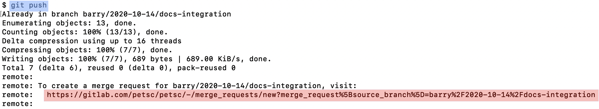

.. image:: images/mr-select-branch.png
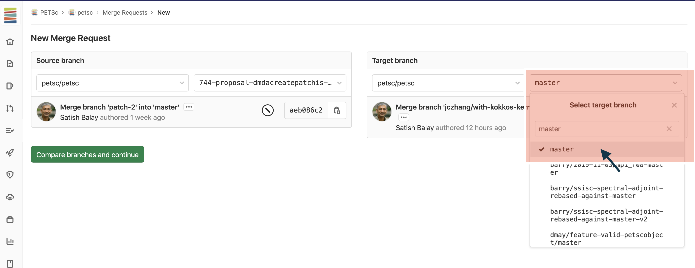

.. image:: images/mr-select-labels.png

.. image:: images/label-subscribe.png

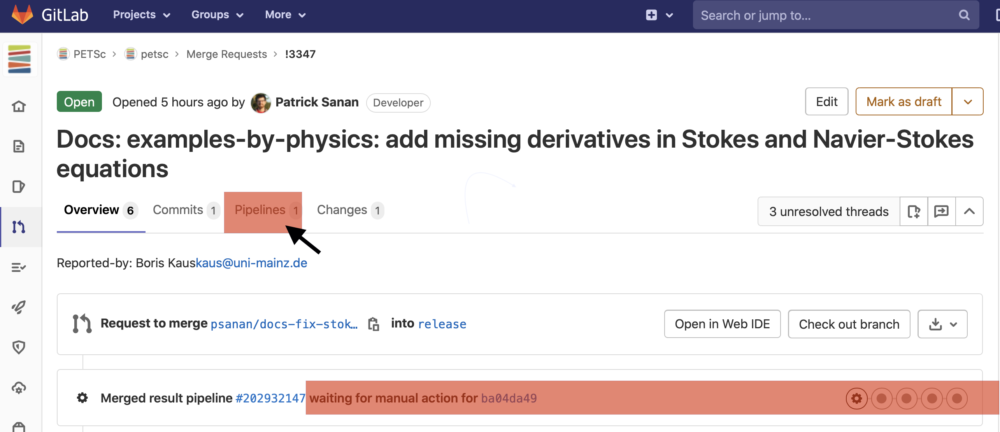

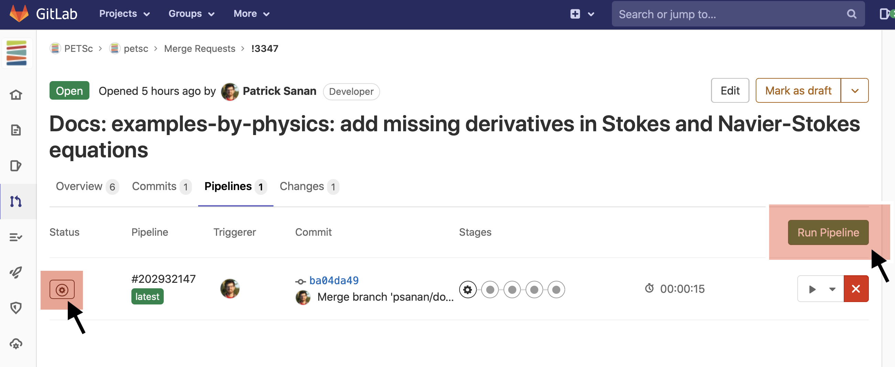

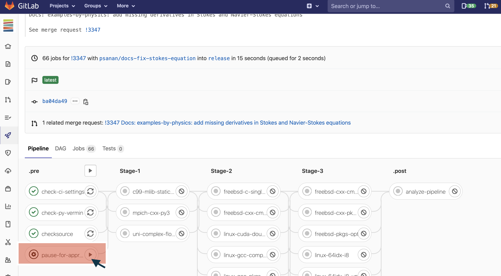

.. image:: images/continued-pipeline.png

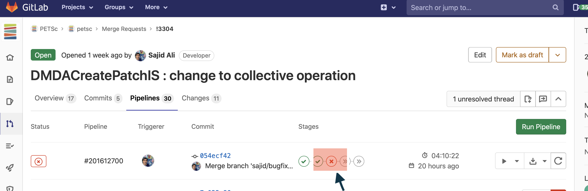

.. image:: images/find-exact-bad-job.png

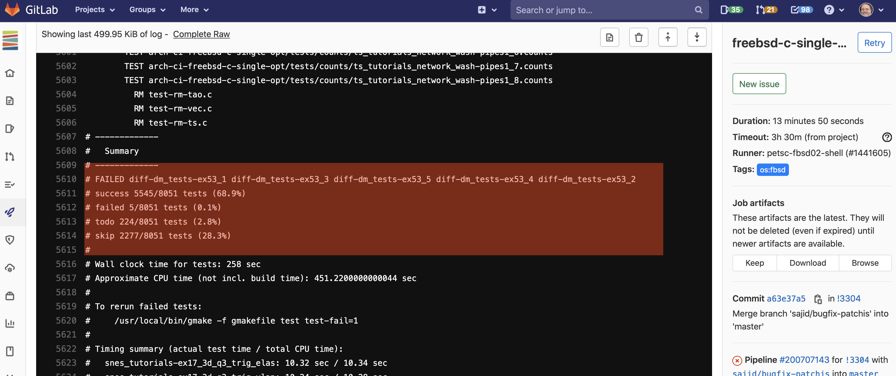

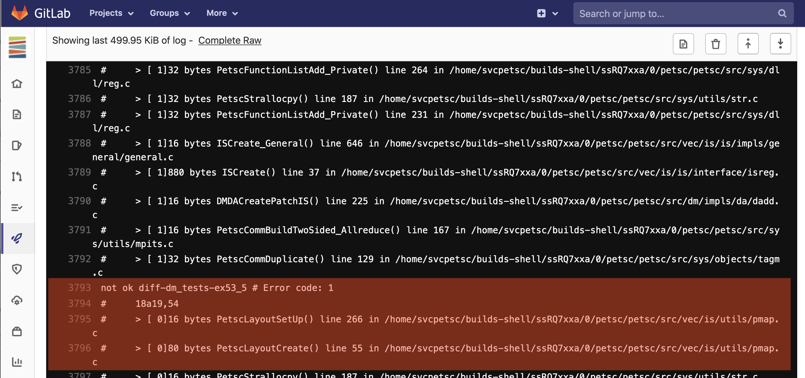

.. image:: images/mr-overview.png

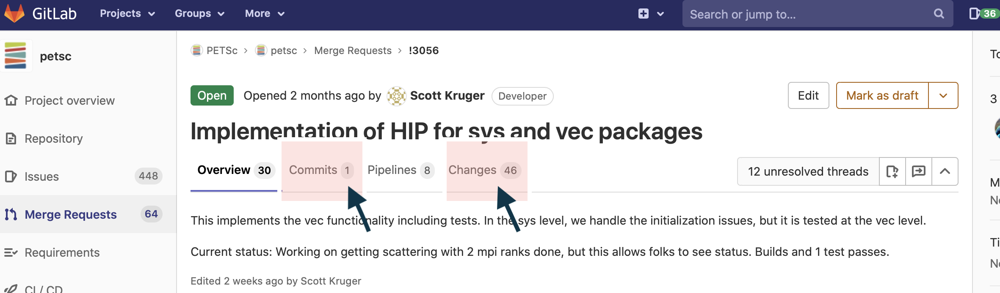

.. image:: images/start-comment-on-code.png

.. image:: images/write-review-text.png

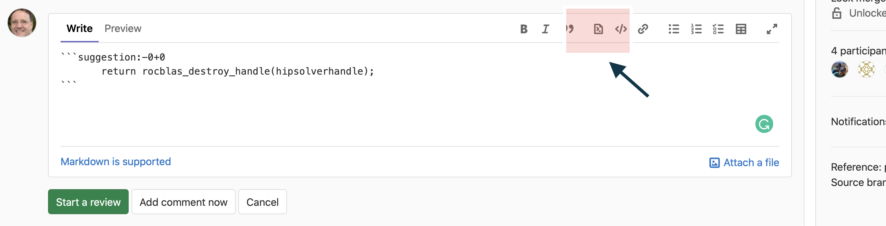

.. image:: images/mr-thread-details.png

.. image:: images/button-for-approvers.png

.. image:: images/approvers.png

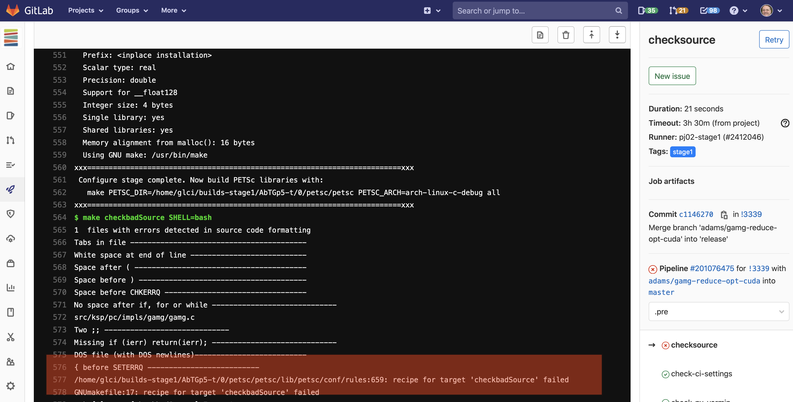

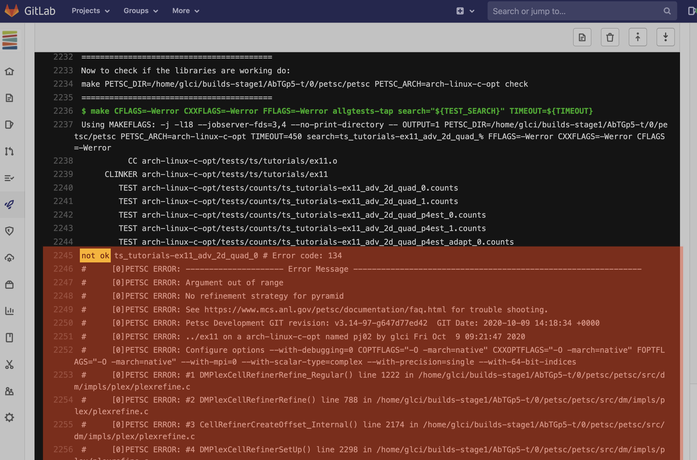

.. image:: images/error-compiling-source.png

.. image:: images/pipeline-configure.png

.. image:: images/pipeline-configure-browse.png

.. image:: images/retry-job.png

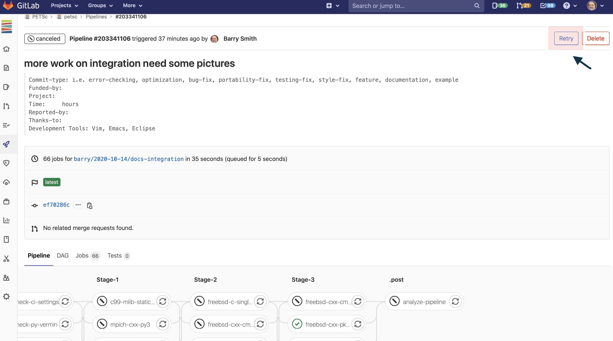

