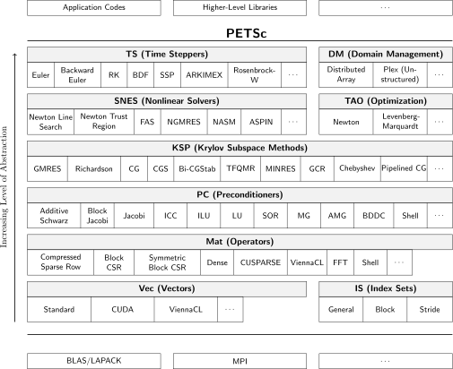

.. _sec-getting-started:

Getting Started
---------------

PETSc consists of a variety of libraries (similar to classes in C++),
which are discussed in detail in later parts of the manual (:doc:`programming` and :doc:`additional`).
Each library manipulates a particular family of objects (for instance,
vectors) and the operations one would like to perform on the objects.
The objects and operations in PETSc are derived from our long
experiences with scientific computation. Some of the PETSc modules deal
with

-  index sets (``IS``), including permutations, for indexing into
   vectors, renumbering, etc;

-  vectors (``Vec``);

-  matrices (``Mat``) (generally sparse);

-  over thirty Krylov subspace methods (``KSP``);

-  dozens of preconditioners, including multigrid, block solvers, and
   sparse direct solvers (``PC``);

-  nonlinear solvers (``SNES``);

-  timesteppers for solving time-dependent (nonlinear) PDEs, including
   support for differential algebraic equations, and the computation of
   adjoints (sensitivities/gradients of the solutions); and (``TS``)

-  managing interactions between mesh data structures and vectors,
   matrices, and solvers (``DM``);

Each consists of an abstract interface (simply a set of calling
sequences) and one or more implementations using particular data
structures. Thus, PETSc provides clean and effective codes for the
various phases of solving PDEs, with a uniform approach for each class
of problem. This design enables easy comparison and use of different
algorithms (for example, to experiment with different Krylov subspace
methods, preconditioners, or truncated Newton methods). Hence, PETSc
provides a rich environment for modeling scientific applications as well
as for rapid algorithm design and prototyping.

The libraries enable easy customization and extension of both algorithms
and implementations. This approach promotes code reuse and flexibility,
and separates the issues of parallelism from the choice of algorithms.
The PETSc infrastructure creates a foundation for building large-scale
applications.

It is useful to consider the interrelationships among different pieces
of PETSc. :any:`fig_library` is a diagram of some
of these pieces. The figure illustrates the library’s hierarchical
organization, which enables users to employ the solvers that are most
appropriate for a particular problem.

  Numerical Libraries in PETSc

Suggested Reading
~~~~~~~~~~~~~~~~~

The manual is divided into three parts:

-  :doc:`introduction`

-  :doc:`programming`

-  :doc:`additional`

:doc:`introduction` describes the basic procedure for using the PETSc library and
presents two simple examples of solving linear systems with PETSc. This
section conveys the typical style used throughout the library and
enables the application programmer to begin using the software
immediately. Part I is also distributed separately for individuals
interested in an overview of the PETSc software, excluding the details
of library usage. Readers of this separate distribution of Part I should
note that all references within the text to particular chapters and
sections indicate locations in the complete users manual.

:doc:`programming` explains in detail the use of the various PETSc libraries, such
as vectors, matrices, index sets, linear and nonlinear solvers, and
graphics. :doc:`additional` describes a variety of useful information, including
profiling, the options database, viewers, error handling, and some
details of PETSc design.

PETSc has evolved to become quite a comprehensive package, and therefore
this manual can be rather intimidating for new users. We
recommend that one initially read the entire document before proceeding
with serious use of PETSc, but bear in mind that PETSc can be used
efficiently before one understands all of the material presented here.
Furthermore, the definitive reference for any PETSc function is always
the online manual page.
Manual pages for all PETSc functions can be accessed at
`www.mcs.anl.gov/petsc/documentation <https://www.mcs.anl.gov/petsc/documentation/>`__.
The manual pages provide hyperlinked indices (organized by both concept
and routine name) to the tutorial examples and enable easy movement
among related topics.

Emacs and Vi/Vim users may find the ``etags``/``ctags`` option to be
extremely useful for exploring the PETSc source code. Details of this
feature are provided in :any:`sec-emacs`.

The complete PETSc distribution, manual pages, and additional information are available via the
`PETSc home page <https://www.mcs.anl.gov/petsc>`__. The PETSc
home page also contains details regarding installation, new features and
changes in recent versions of PETSc, machines that we currently support,
and a frequently asked questions (FAQ) list.

**Note to Fortran Programmers**: In most of the manual, the examples and calling sequences are given
for the C/C++ family of programming languages. However, pure Fortran
programmers can use most of the functionality of PETSc from Fortran,
with only minor differences in the user interface.
:any:`chapter_fortran` provides a discussion of the differences between
using PETSc from Fortran and C, as well as several complete Fortran
examples. This chapter also introduces some routines that support
direct use of Fortran90 pointers.

**Note to Python Programmers**: To program with PETSc in Python you need to install the
PETSc4py package developed by Lisandro Dalcin. This can be done by
configuring PETSc with the option ``--download-petsc4py``. See the
`PETSc installation guide <https://www.mcs.anl.gov/petsc/documentation/installation.html>`__ 
for more details.

.. _sec-running:

Running PETSc Programs
~~~~~~~~~~~~~~~~~~~~~~

Before using PETSc, the user must first set the environmental variable
``PETSC_DIR``, indicating the full path of the PETSc home directory. For
example, under the UNIX bash shell a command of the form

.. code-block:: bash

   export PETSC_DIR=$HOME/petsc

can be placed in the user’s ``.bashrc`` or other startup file. In
addition, the user may need to set the environment variable
``PETSC_ARCH`` to specify a particular configuration of the PETSc
libraries. Note that ``PETSC_ARCH`` is just a name selected by the
installer to refer to the libraries compiled for a particular set of
compiler options and machine type. Using different values of
``PETSC_ARCH`` allows one to switch between several different sets (say
debug and optimized) of libraries easily. To determine if you need to
set ``PETSC_ARCH``, look in the directory indicated by ``PETSC_DIR``, if
there are subdirectories beginning with ``arch`` then those
subdirectories give the possible values for ``PETSC_ARCH``.

All PETSc programs use the MPI (Message Passing Interface) standard for
message-passing communication :cite:`MPI-final`. Thus, to
execute PETSc programs, users must know the procedure for beginning MPI
jobs on their selected computer system(s). For instance, when using the
`MPICH <https://www.mpich.org/>`__ implementation of MPI and many
others, the following command initiates a program that uses eight
processors:

.. code-block:: bash

   mpiexec -n 8 ./petsc_program_name petsc_options

PETSc also comes with a script that automatically uses the correct
``mpiexec`` for your configuration.

.. code-block:: bash

   ${PETSC_DIR}/lib/petsc/bin/petscmpiexec -n 8 ./petsc_program_name petsc_options

All PETSc-compliant programs support the use of the ``-h`` or ``-help``
option as well as the ``-v`` or ``-version`` option.

Certain options are supported by all PETSc programs. We list a few
particularly useful ones below; a complete list can be obtained by
running any PETSc program with the option ``-help``.

-  ``-log_view`` - summarize the program’s performance (see :any:`ch_profiling`)

-  ``-fp_trap`` - stop on floating-point exceptions; for example divide
   by zero

-  ``-malloc_dump`` - enable memory tracing; dump list of unfreed memory
   at conclusion of the run, see
   :any:`detecting-memory-problems`,

-  ``-malloc_debug`` - enable memory tracing (by default this is
   activated for the debugging version of PETSc), see
   :any:`detecting-memory-problems`,

-  ``-start_in_debugger`` ``[noxterm,gdb,dbx,xxgdb]``
   ``[-display name]`` - start all processes in debugger. See
   :any:`sec-debugging`, for more information on
   debugging PETSc programs.

-  ``-on_error_attach_debugger`` ``[noxterm,gdb,dbx,xxgdb]``
   ``[-display name]`` - start debugger only on encountering an error

-  ``-info`` - print a great deal of information about what the program
   is doing as it runs

-  ``-options_file`` ``filename`` - read options from a file

.. _sec_writing:

Writing PETSc Programs
~~~~~~~~~~~~~~~~~~~~~~

Most PETSc programs begin with a call to

::

   PetscInitialize(int *argc,char ***argv,char *file,char *help);

which initializes PETSc and MPI. The arguments ``argc`` and ``argv`` are
the command line arguments delivered in all C and C++ programs. The
argument ``file`` optionally indicates an alternative name for the PETSc
options file, ``.petscrc``, which resides by default in the user’s home
directory. :any:`sec_options` provides details
regarding this file and the PETSc options database, which can be used
for runtime customization. The final argument, ``help``, is an optional
character string that will be printed if the program is run with the
``-help`` option. In Fortran the initialization command has the form

.. code-block:: fortran

   call PetscInitialize(character(*) file,integer ierr)

``PetscInitialize()`` automatically calls ``MPI_Init()`` if MPI has not
been not previously initialized. In certain circumstances in which MPI
needs to be initialized directly (or is initialized by some other
library), the user can first call ``MPI_Init()`` (or have the other
library do it), and then call ``PetscInitialize()``. By default,
``PetscInitialize()`` sets the PETSc “world” communicator, given by
``PETSC_COMM_WORLD``, to ``MPI_COMM_WORLD``.

For those not familiar with MPI, a *communicator* is a way of indicating
a collection of processes that will be involved together in a
calculation or communication. Communicators have the variable type
``MPI_Comm``. In most cases users can employ the communicator
``PETSC_COMM_WORLD`` to indicate all processes in a given run and
``PETSC_COMM_SELF`` to indicate a single process.

MPI provides routines for generating new communicators consisting of
subsets of processors, though most users rarely need to use these. The
book *Using MPI*, by Lusk, Gropp, and Skjellum
:cite:`using-mpi` provides an excellent introduction to the
concepts in MPI. See also the `MPI homepage <https://www.mcs.anl.gov/research/projects/mpi/>`__. 
Note that PETSc users
need not program much message passing directly with MPI, but they must
be familiar with the basic concepts of message passing and distributed
memory computing.

All PETSc routines return a ``PetscErrorCode``, which is an integer
indicating whether an error has occurred during the call. The error code
is set to be nonzero if an error has been detected; otherwise, it is
zero. For the C/C++ interface, the error variable is the routine’s
return value, while for the Fortran version, each PETSc routine has as
its final argument an integer error variable. Error tracebacks are
discussed in the following section.

All PETSc programs should call ``PetscFinalize()`` as their final (or
nearly final) statement, as given below in the C/C++ and Fortran
formats, respectively:

.. code-block:: c

   PetscFinalize();

.. code-block:: fortran

   call PetscFinalize(ierr)

This routine handles options to be called at the conclusion of the
program, and calls ``MPI_Finalize()`` if ``PetscInitialize()`` began
MPI. If MPI was initiated externally from PETSc (by either the user or
another software package), the user is responsible for calling
``MPI_Finalize()``.

.. _sec_simple:

Simple PETSc Examples
~~~~~~~~~~~~~~~~~~~~~

To help the user start using PETSc immediately, we begin with a simple
uniprocessor example that
solves the one-dimensional Laplacian problem with finite differences.
This sequential code, which can be found in
``$PETSC_DIR/src/ksp/ksp/tutorials/ex1.c``, illustrates the solution of
a linear system with ``KSP``, the interface to the preconditioners,
Krylov subspace methods, and direct linear solvers of PETSc. Following
the code we highlight a few of the most important parts of this example.

.. admonition:: Listing: ``src/ksp/ksp/tutorials/ex1.c``
   :name: ksp-ex1

   .. literalinclude:: ../../../ksp/ksp/tutorials/ex1.c
      :end-before: /*TEST

Include Files
^^^^^^^^^^^^^

The C/C++ include files for PETSc should be used via statements such as

::

   #include <petscksp.h>

where ``petscksp.h`` is the include file for the linear solver library.
Each PETSc program must specify an include file that corresponds to the
highest level PETSc objects needed within the program; all of the
required lower level include files are automatically included within the
higher level files. For example, ``petscksp.h`` includes ``petscmat.h``
(matrices), ``petscvec.h`` (vectors), and ``petscsys.h`` (base PETSc
file). The PETSc include files are located in the directory
``${PETSC_DIR}/include``. See :any:`sec_fortran_includes`
for a discussion of PETSc include files in Fortran programs.

The Options Database
^^^^^^^^^^^^^^^^^^^^

As shown in :any:`sec_simple`, the user can
input control data at run time using the options database. In this
example the command ``PetscOptionsGetInt(NULL,NULL,"-n",&n,&flg);``
checks whether the user has provided a command line option to set the
value of ``n``, the problem dimension. If so, the variable ``n`` is set
accordingly; otherwise, ``n`` remains unchanged. A complete description
of the options database may be found in :any:`sec_options`.

.. _sec_vecintro:

Vectors
^^^^^^^

One creates a new parallel or sequential vector, ``x``, of global
dimension ``M`` with the commands

::

   VecCreate(MPI_Comm comm,Vec *x);
   VecSetSizes(Vec x, PetscInt m, PetscInt M);

where ``comm`` denotes the MPI communicator and ``m`` is the optional
local size which may be ``PETSC_DECIDE``. The type of storage for the
vector may be set with either calls to ``VecSetType()`` or
``VecSetFromOptions()``. Additional vectors of the same type can be
formed with

::

   VecDuplicate(Vec old,Vec *new);

The commands

::

   VecSet(Vec x,PetscScalar value);
   VecSetValues(Vec x,PetscInt n,PetscInt *indices,PetscScalar *values,INSERT_VALUES);

respectively set all the components of a vector to a particular scalar
value and assign a different value to each component. More detailed
information about PETSc vectors, including their basic operations,
scattering/gathering, index sets, and distributed arrays, is discussed
in Chapter :any:`chapter_vectors`.

Note the use of the PETSc variable type ``PetscScalar`` in this example.
The ``PetscScalar`` is simply defined to be ``double`` in C/C++ (or
correspondingly ``double precision`` in Fortran) for versions of PETSc
that have *not* been compiled for use with complex numbers. The
``PetscScalar`` data type enables identical code to be used when the
PETSc libraries have been compiled for use with complex numbers.
:any:`sec_complex` discusses the use of complex
numbers in PETSc programs.

.. _sec_matintro:

Matrices
^^^^^^^^

Usage of PETSc matrices and vectors is similar. The user can create a
new parallel or sequential matrix, ``A``, which has ``M`` global rows
and ``N`` global columns, with the routines

::

   MatCreate(MPI_Comm comm,Mat *A);
   MatSetSizes(Mat A,PETSC_DECIDE,PETSC_DECIDE,PetscInt M,PetscInt N);

where the matrix format can be specified at runtime via the options
database. The user could alternatively specify each processes’ number of
local rows and columns using ``m`` and ``n``.

::

   MatSetSizes(Mat A,PetscInt m,PetscInt n,PETSC_DETERMINE,PETSC_DETERMINE);

Generally one then sets the “type” of the matrix, with, for example,

::

   MatSetType(A,MATAIJ);

This causes the matrix ``A`` to used the compressed sparse row storage
format to store the matrix entries. See ``MatType`` for a list of all
matrix types. Values can then be set with the command

::

   MatSetValues(Mat A,PetscInt m,PetscInt *im,PetscInt n,PetscInt *in,PetscScalar *values,INSERT_VALUES);

After all elements have been inserted into the matrix, it must be
processed with the pair of commands

::

   MatAssemblyBegin(A,MAT_FINAL_ASSEMBLY);
   MatAssemblyEnd(A,MAT_FINAL_ASSEMBLY);

:any:`chapter_matrices` discusses various matrix formats as
well as the details of some basic matrix manipulation routines.

Linear Solvers
^^^^^^^^^^^^^^

After creating the matrix and vectors that define a linear system,
``Ax`` :math:`=` ``b``, the user can then use ``KSP`` to solve the
system with the following sequence of commands:

::

   KSPCreate(MPI_Comm comm,KSP *ksp);
   KSPSetOperators(KSP ksp,Mat Amat,Mat Pmat);
   KSPSetFromOptions(KSP ksp);
   KSPSolve(KSP ksp,Vec b,Vec x);
   KSPDestroy(KSP ksp);

The user first creates the ``KSP`` context and sets the operators
associated with the system (matrix that defines the linear system,
``Amat`` and matrix from which the preconditioner is constructed,
``Pmat``). The user then sets various options for customized solution,
solves the linear system, and finally destroys the ``KSP`` context. We
emphasize the command ``KSPSetFromOptions()``, which enables the user to
customize the linear solution method at runtime by using the options
database, which is discussed in :any:`sec_options`. Through this database, the
user not only can select an iterative method and preconditioner, but
also can prescribe the convergence tolerance, set various monitoring
routines, etc. (see, e.g., :any:`sec_profiling_programs`).

:any:`chapter_ksp` describes in detail the ``KSP`` package,
including the ``PC`` and ``KSP`` packages for preconditioners and Krylov
subspace methods.

Nonlinear Solvers
^^^^^^^^^^^^^^^^^

Most PDE problems of interest are inherently nonlinear. PETSc provides
an interface to tackle the nonlinear problems directly called ``SNES``.
:any:`chapter_snes` describes the nonlinear
solvers in detail. We recommend most PETSc users work directly with
``SNES``, rather than using PETSc for the linear problem within a
nonlinear solver.

Error Checking
^^^^^^^^^^^^^^

All PETSc routines return an integer indicating whether an error has
occurred during the call. The PETSc macro ``CHKERRQ(ierr)`` checks the
value of ``ierr`` and calls the PETSc error handler upon error
detection. ``CHKERRQ(ierr)`` should be used in all subroutines to enable
a complete error traceback. Below, we indicate a traceback
generated by error detection within a sample PETSc program. The error
occurred on line 3618 of the file
``${PETSC_DIR}/src/mat/impls/aij/seq/aij.c`` and was caused by trying to
allocate too large an array in memory. The routine was called in the
program ``ex3.c`` on line 66. See
:any:`sec_fortran_errors` for details regarding error checking
when using the PETSc Fortran interface.

.. code-block:: none

    $ cd $PETSC_DIR/src/ksp/ksp/tutorials
    $ make ex3
    $ mpiexec -n 1 ./ex3 -m 100000
    [0]PETSC ERROR: --------------------- Error Message --------------------------------
    [0]PETSC ERROR: Out of memory. This could be due to allocating
    [0]PETSC ERROR: too large an object or bleeding by not properly
    [0]PETSC ERROR: destroying unneeded objects.
    [0]PETSC ERROR: Memory allocated 11282182704 Memory used by process 7075897344
    [0]PETSC ERROR: Try running with -malloc_dump or -malloc_view for info.
    [0]PETSC ERROR: Memory requested 18446744072169447424
    [0]PETSC ERROR: See https://www.mcs.anl.gov/petsc/documentation/faq.html for trouble shooting.
    [0]PETSC ERROR: Petsc Development GIT revision: v3.7.1-224-g9c9a9c5  GIT Date: 2016-05-18 22:43:00 -0500
    [0]PETSC ERROR: ./ex3 on a arch-darwin-double-debug named Patricks-MacBook-Pro-2.local by patrick Mon Jun 27 18:04:03 2016
    [0]PETSC ERROR: Configure options PETSC_DIR=/Users/patrick/petsc PETSC_ARCH=arch-darwin-double-debug --download-mpich --download-f2cblaslapack --with-cc=clang --with-cxx=clang++ --with-fc=gfortran --with-debugging=1 --with-precision=double --with-scalar-type=real --with-viennacl=0 --download-c2html -download-sowing
    [0]PETSC ERROR: #1 MatSeqAIJSetPreallocation_SeqAIJ() line 3618 in /Users/patrick/petsc/src/mat/impls/aij/seq/aij.c
    [0]PETSC ERROR: #2 PetscTrMallocDefault() line 188 in /Users/patrick/petsc/src/sys/memory/mtr.c
    [0]PETSC ERROR: #3 MatSeqAIJSetPreallocation_SeqAIJ() line 3618 in /Users/patrick/petsc/src/mat/impls/aij/seq/aij.c
    [0]PETSC ERROR: #4 MatSeqAIJSetPreallocation() line 3562 in /Users/patrick/petsc/src/mat/impls/aij/seq/aij.c
    [0]PETSC ERROR: #5 main() line 66 in /Users/patrick/petsc/src/ksp/ksp/tutorials/ex3.c
    [0]PETSC ERROR: PETSc Option Table entries:
    [0]PETSC ERROR: -m 100000
    [0]PETSC ERROR: ----------------End of Error Message ------- send entire error message to petsc-maint@mcs.anl.gov----------

When running the debug version of the PETSc libraries, it does a great
deal of checking for memory corruption (writing outside of array bounds
etc). The macro ``CHKMEMQ`` can be called anywhere in the code to check
the current status of the memory for corruption. By putting several (or
many) of these macros into your code you can usually easily track down
in what small segment of your code the corruption has occured. One can
also use Valgrind to track down memory errors; see the `FAQ <https://www.mcs.anl.gov/petsc/documentation/faq.html>`__.

.. _sec_parallel:

Parallel Programming
^^^^^^^^^^^^^^^^^^^^

Since PETSc uses the message-passing model for parallel programming and
employs MPI for all interprocessor communication, the user is free to
employ MPI routines as needed throughout an application code. However,
by default the user is shielded from many of the details of message
passing within PETSc, since these are hidden within parallel objects,
such as vectors, matrices, and solvers. In addition, PETSc provides
tools such as generalized vector scatters/gathers to assist in the
management of parallel data.

Recall that the user must specify a communicator upon creation of any
PETSc object (such as a vector, matrix, or solver) to indicate the
processors over which the object is to be distributed. For example, as
mentioned above, some commands for matrix, vector, and linear solver
creation are:

::

   MatCreate(MPI_Comm comm,Mat *A);
   VecCreate(MPI_Comm comm,Vec *x);
   KSPCreate(MPI_Comm comm,KSP *ksp);

The creation routines are collective over all processors in the
communicator; thus, all processors in the communicator *must* call the
creation routine. In addition, if a sequence of collective routines is
being used, they *must* be called in the same order on each processor.

The next example, given below,
illustrates the solution of a linear system in parallel. This code,
corresponding to
`KSP Tutorial ex2 <https://www.mcs.anl.gov/petsc/petsc-current/src/ksp/ksp/tutorials/ex2.c.html>`,
handles the two-dimensional Laplacian discretized with finite
differences, where the linear system is again solved with KSP. The code
performs the same tasks as the sequential version within
:any:`sec_simple`. Note that the user interface
for initiating the program, creating vectors and matrices, and solving
the linear system is *exactly* the same for the uniprocessor and
multiprocessor examples. The primary difference between the examples in
:any:`sec_simple` and
here is that each processor forms only its
local part of the matrix and vectors in the parallel case.

.. admonition:: Listing: ``src/ksp/ksp/tutorials/ex2.c``
   :name: ksp-ex2

   .. literalinclude:: ../../../ksp/ksp/tutorials/ex2.c
      :end-before: /*TEST

.. raw:: latex

  \newpage

Compiling and Running Programs
^^^^^^^^^^^^^^^^^^^^^^^^^^^^^^

The output below illustrates compiling and running a
PETSc program using MPICH on an OS X laptop. Note that different
machines will have compilation commands as determined by the
configuration process. See :any:`sec_writing_application_codes` for
a discussion about how to compile your PETSc programs. Users who are
experiencing difficulties linking PETSc programs should refer to the FAQ
on the PETSc website https://www.mcs.anl.gov/petsc or given in the file
``$PETSC_DIR/docs/faq.html``.

.. code-block:: none

   $ cd $PETSC_DIR/src/ksp/ksp/tutorials
   $ make ex2
   /Users/patrick/petsc/arch-darwin-double-debug/bin/mpicc -o ex2.o -c -Wall -Wwrite-strings -Wno-strict-aliasing -Wno-unknown-pragmas -Qunused-arguments -fvisibility=hidden -g3   -I/Users/patrick/petsc/include -I/Users/patrick/petsc/arch-darwin-double-debug/include -I/opt/X11/include -I/opt/local/include    `pwd`/ex2.c
   /Users/patrick/petsc/arch-darwin-double-debug/bin/mpicc -Wl,-multiply_defined,suppress -Wl,-multiply_defined -Wl,suppress -Wl,-commons,use_dylibs -Wl,-search_paths_first -Wl,-multiply_defined,suppress -Wl,-multiply_defined -Wl,suppress -Wl,-commons,use_dylibs -Wl,-search_paths_first    -Wall -Wwrite-strings -Wno-strict-aliasing -Wno-unknown-pragmas -Qunused-arguments -fvisibility=hidden -g3  -o ex2 ex2.o  -Wl,-rpath,/Users/patrick/petsc/arch-darwin-double-debug/lib -L/Users/patrick/petsc/arch-darwin-double-debug/lib  -lpetsc -Wl,-rpath,/Users/patrick/petsc/arch-darwin-double-debug/lib -lf2clapack -lf2cblas -Wl,-rpath,/opt/X11/lib -L/opt/X11/lib -lX11 -lssl -lcrypto -Wl,-rpath,/Applications/Xcode.app/Contents/Developer/Toolchains/XcodeDefault.xctoolchain/usr/lib/clang/7.0.2/lib/darwin -L/Applications/Xcode.app/Contents/Developer/Toolchains/XcodeDefault.xctoolchain/usr/lib/clang/7.0.2/lib/darwin -lmpifort -lgfortran -Wl,-rpath,/opt/local/lib/gcc5/gcc/x86_64-apple-darwin14/5.3.0 -L/opt/local/lib/gcc5/gcc/x86_64-apple-darwin14/5.3.0 -Wl,-rpath,/opt/local/lib/gcc5 -L/opt/local/lib/gcc5 -lgfortran -lgcc_ext.10.5 -lquadmath -lm -lclang_rt.osx -lmpicxx -lc++ -Wl,-rpath,/Applications/Xcode.app/Contents/Developer/Toolchains/XcodeDefault.xctoolchain/usr/bin/../lib/clang/7.0.2/lib/darwin -L/Applications/Xcode.app/Contents/Developer/Toolchains/XcodeDefault.xctoolchain/usr/bin/../lib/clang/7.0.2/lib/darwin -lclang_rt.osx -Wl,-rpath,/Users/patrick/petsc/arch-darwin-double-debug/lib -L/Users/patrick/petsc/arch-darwin-double-debug/lib -ldl -lmpi -lpmpi -lSystem -Wl,-rpath,/Applications/Xcode.app/Contents/Developer/Toolchains/XcodeDefault.xctoolchain/usr/bin/../lib/clang/7.0.2/lib/darwin -L/Applications/Xcode.app/Contents/Developer/Toolchains/XcodeDefault.xctoolchain/usr/bin/../lib/clang/7.0.2/lib/darwin -lclang_rt.osx -ldl
   /bin/rm -f ex2.o
   $ $PETSC_DIR/lib/petsc/bin/petscmpiexec -n 1 ./ex2
   Norm of error 0.000156044 iterations 6
   $ $PETSC_DIR/lib/petsc/bin/petscmpiexec -n 2 ./ex2
   Norm of error 0.000411674 iterations 7

.. _sec_profiling_programs:

Profiling Programs
~~~~~~~~~~~~~~~~~~

The option
``-log_view`` activates printing of a performance summary, including
times, floating point operation (flop) rates, and message-passing
activity. :any:`ch_profiling` provides details about
profiling, including interpretation of the output data below. 
This particular example involves
the solution of a linear system on one processor using GMRES and ILU.
The low floating point operation (flop) rates in this example are due to
the fact that the code solved a tiny system. We include this example
merely to demonstrate the ease of extracting performance information.

.. _listing_exprof:

.. code-block:: none

   $ $PETSC_DIR/lib/petsc/bin/petscmpiexec -n 1 ./ex1 -n 1000 -pc_type ilu -ksp_type gmres -ksp_rtol 1.e-7 -log_view
   ...
   ------------------------------------------------------------------------------------------------------------------------
   Event                Count      Time (sec)     Flops                             --- Global ---  --- Stage ----  Total
                      Max Ratio  Max     Ratio   Max  Ratio  Mess   AvgLen  Reduct  %T %F %M %L %R  %T %F %M %L %R Mflop/s
   ------------------------------------------------------------------------------------------------------------------------

   --- Event Stage 0: Main Stage

   VecMDot                1 1.0 3.2830e-06 1.0 2.00e+03 1.0 0.0e+00 0.0e+00 0.0e+00  0  5  0  0  0   0  5  0  0  0   609
   VecNorm                3 1.0 4.4550e-06 1.0 6.00e+03 1.0 0.0e+00 0.0e+00 0.0e+00  0 14  0  0  0   0 14  0  0  0  1346
   VecScale               2 1.0 4.0110e-06 1.0 2.00e+03 1.0 0.0e+00 0.0e+00 0.0e+00  0  5  0  0  0   0  5  0  0  0   499
   VecCopy                1 1.0 3.2280e-06 1.0 0.00e+00 0.0 0.0e+00 0.0e+00 0.0e+00  0  0  0  0  0   0  0  0  0  0     0
   VecSet                11 1.0 2.5537e-05 1.0 0.00e+00 0.0 0.0e+00 0.0e+00 0.0e+00  2  0  0  0  0   2  0  0  0  0     0
   VecAXPY                2 1.0 2.0930e-06 1.0 4.00e+03 1.0 0.0e+00 0.0e+00 0.0e+00  0 10  0  0  0   0 10  0  0  0  1911
   VecMAXPY               2 1.0 1.1280e-06 1.0 4.00e+03 1.0 0.0e+00 0.0e+00 0.0e+00  0 10  0  0  0   0 10  0  0  0  3546
   VecNormalize           2 1.0 9.3970e-06 1.0 6.00e+03 1.0 0.0e+00 0.0e+00 0.0e+00  1 14  0  0  0   1 14  0  0  0   638
   MatMult                2 1.0 1.1177e-05 1.0 9.99e+03 1.0 0.0e+00 0.0e+00 0.0e+00  1 24  0  0  0   1 24  0  0  0   894
   MatSolve               2 1.0 1.9933e-05 1.0 9.99e+03 1.0 0.0e+00 0.0e+00 0.0e+00  1 24  0  0  0   1 24  0  0  0   501
   MatLUFactorNum         1 1.0 3.5081e-05 1.0 4.00e+03 1.0 0.0e+00 0.0e+00 0.0e+00  2 10  0  0  0   2 10  0  0  0   114
   MatILUFactorSym        1 1.0 4.4259e-05 1.0 0.00e+00 0.0 0.0e+00 0.0e+00 0.0e+00  3  0  0  0  0   3  0  0  0  0     0
   MatAssemblyBegin       1 1.0 8.2015e-08 1.0 0.00e+00 0.0 0.0e+00 0.0e+00 0.0e+00  0  0  0  0  0   0  0  0  0  0     0
   MatAssemblyEnd         1 1.0 3.3536e-05 1.0 0.00e+00 0.0 0.0e+00 0.0e+00 0.0e+00  2  0  0  0  0   2  0  0  0  0     0
   MatGetRowIJ            1 1.0 1.5960e-06 1.0 0.00e+00 0.0 0.0e+00 0.0e+00 0.0e+00  0  0  0  0  0   0  0  0  0  0     0
   MatGetOrdering         1 1.0 3.9791e-05 1.0 0.00e+00 0.0 0.0e+00 0.0e+00 0.0e+00  3  0  0  0  0   3  0  0  0  0     0
   MatView                2 1.0 6.7909e-05 1.0 0.00e+00 0.0 0.0e+00 0.0e+00 0.0e+00  5  0  0  0  0   5  0  0  0  0     0
   KSPGMRESOrthog         1 1.0 7.5970e-06 1.0 4.00e+03 1.0 0.0e+00 0.0e+00 0.0e+00  1 10  0  0  0   1 10  0  0  0   526
   KSPSetUp               1 1.0 3.4424e-05 1.0 0.00e+00 0.0 0.0e+00 0.0e+00 0.0e+00  2  0  0  0  0   2  0  0  0  0     0
   KSPSolve               1 1.0 2.7264e-04 1.0 3.30e+04 1.0 0.0e+00 0.0e+00 0.0e+00 19 79  0  0  0  19 79  0  0  0   121
   PCSetUp                1 1.0 1.5234e-04 1.0 4.00e+03 1.0 0.0e+00 0.0e+00 0.0e+00 11 10  0  0  0  11 10  0  0  0    26
   PCApply                2 1.0 2.1022e-05 1.0 9.99e+03 1.0 0.0e+00 0.0e+00 0.0e+00  1 24  0  0  0   1 24  0  0  0   475
   ------------------------------------------------------------------------------------------------------------------------

   Memory usage is given in bytes:

   Object Type          Creations   Destructions     Memory  Descendants' Mem.
   Reports information only for process 0.

   --- Event Stage 0: Main Stage

                 Vector     8              8        76224     0.
                 Matrix     2              2       134212     0.
          Krylov Solver     1              1        18400     0.
         Preconditioner     1              1         1032     0.
              Index Set     3              3        10328     0.
                 Viewer     1              0            0     0.
   ========================================================================================================================
   ...

.. _sec_writing_application_codes:

Writing Application Codes with PETSc
~~~~~~~~~~~~~~~~~~~~~~~~~~~~~~~~~~~~

The examples throughout the library demonstrate the software usage and
can serve as templates for developing custom applications. We suggest
that new PETSc users examine programs in the directories
``${PETSC_DIR}/src/<library>/tutorials`` where ``<library>`` denotes any
of the PETSc libraries (listed in the following section), such as
``SNES`` or ``KSP`` or ``TS``. The manual pages located at
``${PETSC_DIR}/docs/index.htm`` or
https://www.mcs.anl.gov/petsc/documentation/ provide links (organized by
both routine names and concepts) to the tutorial examples.

To write a new application program using PETSc, we suggest the following
procedure:

#. Install and test PETSc according to the instructions at the PETSc web
   site.

#. Make a working directory for your source code: for example,
   ``mkdir $HOME/application``

#. Change to that working directory; for
   example,\ ``cd $HOME/application``

#. Copy one of the examples in the directory that corresponds to the
   class of problem of interest into your working directory, for
   example, ``cp $PETSC_DIR/src/snes/tutorials/ex19.c ex19.c``

#. Copy $PETSC_DIR/share/petsc/Makefile.user to your working directory,
   for example, ``cp $PETSC_DIR/share/petsc/Makefile.user Makefile``

#. Compile and run the example program, for example,
   ``make ex19; ./ex19``

#. Use the example program as a starting point for developing a custom
   code.

We highly recommend against the following since it requires changing
your makefile for each new configuration/computing system but if you do
not wish to include any PETSc utilities in your makefile, you can use
the following commands in the PETSc root directory to get the
information needed by your makefile:

.. code-block:: bash

   make getlinklibs getincludedirs getcflags getcxxflags getfortranflags getccompiler getfortrancompiler getcxxcompiler

All the libraries listed need to be linked into your executable and the
include directories and flags need to be passed to the compiler. Usually
this is done with ``CFLAGS=<list of -I and other flags>`` and
``FFLAGS=<list of -I and other flags>`` in your makefile.

Citing PETSc
~~~~~~~~~~~~

If you use the TS component of PETSc please cite the following:

.. code-block:: none

   @article{abhyankar2018petsc,
     title={PETSc/TS: A Modern Scalable ODE/DAE Solver Library},
     author={Abhyankar, Shrirang and Brown, Jed and Constantinescu, Emil M and Ghosh, Debojyoti and Smith, Barry F and Zhang, Hong},
     journal={arXiv preprint arXiv:1806.01437},
     year={2018}
   }

When citing PETSc in a publication please cite the following:

.. code-block:: none

   @Misc{petsc-web-page,
      Author = "Satish Balay and Shrirang Abhyankar and Mark~F. Adams and Jed Brown
      and Peter Brune and Kris Buschelman and Lisandro Dalcin and Alp Dener and Victor Eijkhout
      and William~D. Gropp and Dinesh Kaushik and Matthew~G. Knepley and Dave~A. May
      and Lois Curfman McInnes and Richard Tran Mills and Todd Munson and Karl Rupp
      and Patrick Sanan and Barry~F. Smith and Stefano Zampini and Hong Zhang and Hong Zhang",
      Title  = "{PETS}c {W}eb page",
      Note   = "https://www.mcs.anl.gov/petsc",
      Year   = "2020"}

   @TechReport{petsc-user-ref,
      Author = "Satish Balay and Shrirang Abhyankar and Mark~F. Adams and Jed Brown
      and Peter Brune and Kris Buschelman and Lisandro Dalcin and Alp Dener and Victor Eijkhout
      and William~D. Gropp and Dinesh Kaushik and Matthew~G. Knepley and Dave~A. May
      and Lois Curfman McInnes and Richard Tran Mills and Todd Munson and Karl Rupp
      and Patrick Sanan and Barry~F. Smith and Stefano Zampini and Hong Zhang and Hong Zhang",
      Title       = "{PETS}c Users Manual",
      Number      = "ANL-95/11 - Revision 3.13",
      Institution = "Argonne National Laboratory",
      Year        = "2020"}

   @InProceedings{petsc-efficient,
      Author    = "Satish Balay and William D. Gropp and Lois C. McInnes and Barry F. Smith",
      Title     = "Efficient Management of Parallelism in Object Oriented
                   Numerical Software Libraries",
      Booktitle = "Modern Software Tools in Scientific Computing",
      Editor    = "E. Arge and A. M. Bruaset and H. P. Langtangen",
      Pages     = "163--202",
      Publisher = "Birkhauser Press",
      Year      = "1997"}

.. _sec_directory:

Directory Structure
~~~~~~~~~~~~~~~~~~~

We conclude this introduction with an overview of the organization of
the PETSc software. The root directory of PETSc contains the following
directories:

-  ``docs`` (only in the tarball distribution of PETSc; not the git
   repository) - All documentation for PETSc. The files ``manual.pdf``
   contains the hyperlinked users manual, suitable for printing or
   on-screen viewering. Includes the subdirectory - ``manualpages``
   (on-line manual pages).

-  ``conf`` - Base PETSc configuration files that define the standard
   make variables and rules used by PETSc

-  ``include`` - All include files for PETSc that are visible to the
   user.

-  ``include/petsc/finclude`` - PETSc include files for Fortran
   programmers using the .F suffix (recommended).

-  ``include/petsc/private`` - Private PETSc include files that should
   *not* need to be used by application programmers.

-  ``share`` - Some small test matrices in data files

-  ``src`` - The source code for all PETSc libraries, which currently
   includes

   -  ``vec`` - vectors,

      -  ``is`` - index sets,

   -  ``mat`` - matrices,

   -  ``ksp`` - complete linear equations solvers,

      -  ``ksp`` - Krylov subspace accelerators,

      -  ``pc`` - preconditioners,

   -  ``snes`` - nonlinear solvers

   -  ``ts`` - ODE solvers and timestepping,

   -  ``dm`` - data management between meshes and solvers, vectors, and
      matrices,

   -  ``sys`` - general system-related routines,

      -  ``logging`` - PETSc logging and profiling routines,

      -  ``classes`` - low-level classes

         -  ``draw`` - simple graphics,

         -  ``viewer`` - mechanism for printing and visualizing PETSc
            objects,

         -  ``bag`` - mechanism for saving and loading from disk user
            data stored in C structs.

         -  ``random`` - random number generators.

Each PETSc source code library directory has the following
subdirectories:

-  ``tutorials`` - Programs designed to teach users about PETSc.
    These codes can serve as templates for the design of custom
    applications.

-  ``tests`` - Programs designed for thorough testing of PETSc. As
    such, these codes are not intended for examination by users.

-  ``interface`` - The calling sequences for the abstract interface to
   the component. Code here does not know about particular
   implementations.

-  ``impls`` - Source code for one or more implementations.

-  ``utils`` - Utility routines. Source here may know about the
   implementations, but ideally will not know about implementations for
   other components.

.. raw:: html

    

.. bibliography:: ../../tex/petsc.bib
   :filter: docname in docnames

.. bibliography:: ../../tex/petscapp.bib
   :filter: docname in docnames
