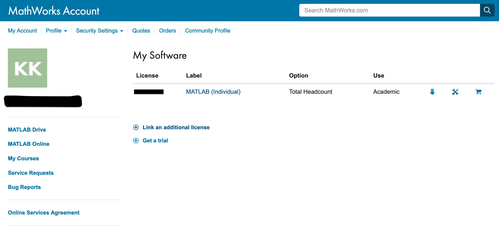
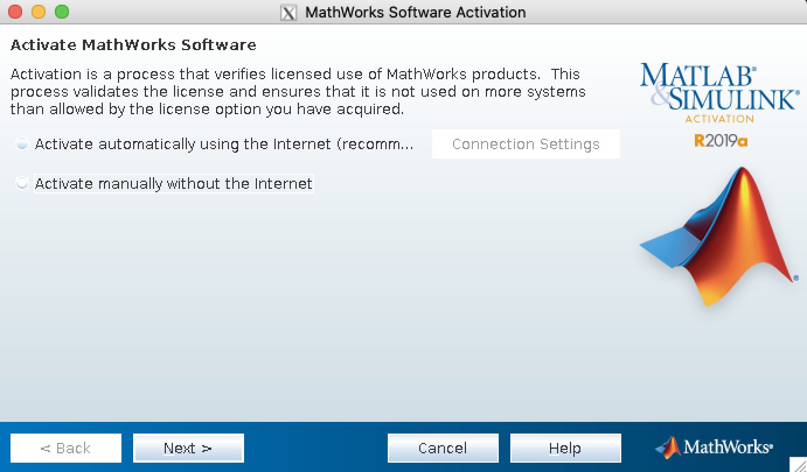
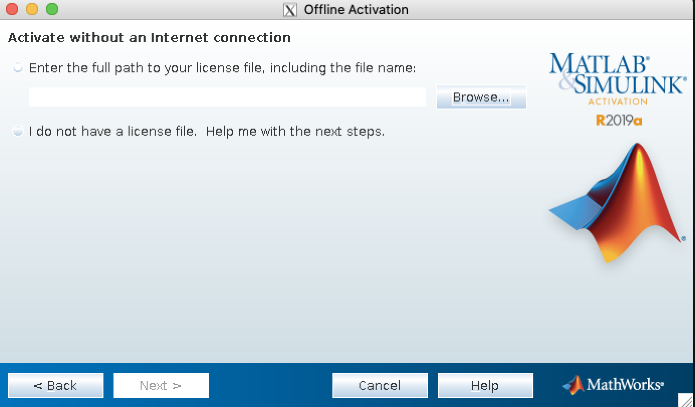

.. _ch_matlab:

Using MATLAB with PETSc
-----------------------

There are three basic ways to use MATLAB with PETSc:

#. (:any:`sec_matlabdump`) dumping files to be read into
   MATLAB,

#. (:any:`sec_matlabsocket`) automatically sending data from
   a running PETSc program to a MATLAB process where you may
   interactively type MATLAB commands (or run scripts), and

#. (:any:`sec_matlabengine`) automatically sending data back
   and forth between PETSc and MATLAB where MATLAB commands are issued
   not interactively but from a script or the PETSc program (this uses
   the MATLAB Engine).

.. _sec_matlabdump:

Dumping Data for MATLAB
~~~~~~~~~~~~~~~~~~~~~~~

Dumping ASCII MATLAB data
^^^^^^^^^^^^^^^^^^^^^^^^^

One can dump PETSc matrices and vectors to the screen in an ASCII format
that MATLAB can read in directly. This is done with the command line
options ``-vec_view ::ascii_matlab`` or ``-mat_view ::ascii_matlab``. To
write a a file, use ``-vec_view :filename.m:ascii_matlab`` or
``-mat_view :filename.m:ascii_matlab``.

This causes the PETSc program to print the vectors and matrices every
time ``VecAssemblyEnd()`` or ``MatAssemblyEnd()`` are called. To provide
finer control over when and what vectors and matrices are dumped one can
use the ``VecView()`` and ``MatView()`` functions with a viewer type of
ASCII (see ``PetscViewerASCIIOpen()``, ``PETSC_VIEWER_STDOUT_WORLD``,
``PETSC_VIEWER_STDOUT_SELF``, or ``PETSC_VIEWER_STDOUT_(MPI_Comm)``).
Before calling the viewer set the output type with, for example,

::

   PetscViewerPushFormat(PETSC_VIEWER_STDOUT_WORLD,PETSC_VIEWER_ASCII_MATLAB);
   VecView(A,PETSC_VIEWER_STDOUT_WORLD);
   PetscViewerPopFormat(PETSC_VIEWER_STDOUT_WORLD);

The name of each PETSc variable printed for MATLAB may be set with

::

   PetscObjectSetName((PetscObject)A,"name");

If no name is specified, the object is given a default name using
``PetscObjectName()``.

Dumping Binary Data for MATLAB
^^^^^^^^^^^^^^^^^^^^^^^^^^^^^^

One can also read PETSc binary files (see
:any:`sec_viewers`) directly into MATLAB via the scripts available
in ``$PETSC_DIR/share/matlab``. This requires less disk space and is
recommended for all but the smallest data sizes. One can also use

::

   PetscViewerPushFormat(viewer,PETSC_VIEWER_BINARY_MATLAB)

to dump both a PETSc binary file and a corresponding ``.info`` file
which ``PetscReadBinaryMatlab.m`` will use to format the binary file in
more complex cases, such as using a ``DMDA``. For an example, see
`DM Tutorial ex7 <https://www.mcs.anl.gov/petsc/petsc-current/src/dm/tutorials/ex7.c.html>`__.
In MATLAB (R2015b), one may then generate a useful structure. For
example:

.. code-block:: bash

   setenv('PETSC_DIR','~/petsc');
   setenv('PETSC_ARCH','arch-darwin-double-debug');
   addpath('~/petsc/share/petsc/matlab');
   gridData=PetscReadBinaryMatlab('output_file');

.. _sec_matlabsocket:

Sending Data to an Interactive MATLAB Session
~~~~~~~~~~~~~~~~~~~~~~~~~~~~~~~~~~~~~~~~~~~~~

One creates a viewer to MATLAB via

::

   PetscViewerSocketOpen(MPI_Comm,char *machine,int port,PetscViewer *v);

(``port`` is usually set to ``PETSC_DEFAULT``; use ``NULL`` for the
machine if the MATLAB interactive session is running on the same machine
as the PETSc program) and then sends matrices or vectors via

::

   VecView(Vec A,v);
   MatView(Mat B,v);

See :any:`sec_viewers` for more on PETSc viewers. One may
start the MATLAB program manually or use the PETSc command
``PetscStartMatlab(MPI_Comm,char *machine,char *script,FILE **fp)``;
where ``machine`` and ``script`` may be ``NULL``. It is also possible to
start your PETSc program from MATLAB via ``launch()``.

To receive the objects in MATLAB, make sure that
``${PETSC_DIR}/${PETSC_ARCH}/lib/petsc/matlab`` and
``${PETSC_DIR}/share/petsc/matlab`` are in the MATLAB path. Use
``p = PetscOpenSocket();`` (or ``p = PetscOpenSocket(portnum)`` if you
provided a port number in your call to ``PetscViewerSocketOpen()``), and
then ``a = PetscBinaryRead(p);`` returns the object passed from PETSc.
``PetscBinaryRead()`` may be called any number of times. Each call
should correspond on the PETSc side with viewing a single vector or
matrix. ``close()`` closes the connection from MATLAB. On the PETSc
side, one should destroy the viewer object with
``PetscViewerDestroy()``.

For an example, which includes sending data back to PETSc, see
`Vec Tutorial ex42 <https://www.mcs.anl.gov/petsc/petsc-current/src/vec/vec/tutorials/ex42.c.html>`__
and the associated ``.m`` file.

.. _sec_matlabengine:

Using the MATLAB Compute Engine
~~~~~~~~~~~~~~~~~~~~~~~~~~~~~~~

One creates access to the MATLAB engine via

::

   PetscMatlabEngineCreate(MPI_Comm comm,char *machine,PetscMatlabEngine *e);

where ``machine`` is the name of the machine hosting MATLAB (``NULL``
may be used for localhost). One can send objects to MATLAB via

::

   PetscMatlabEnginePut(PetscMatlabEngine e,PetscObject obj);

One can get objects via

::

   PetscMatlabEngineGet(PetscMatlabEngine e,PetscObject obj);

Similarly, one can send arrays via

::

   PetscMatlabEnginePutArray(PetscMatlabEngine e,int m,int n,PetscScalar *array,char *name);

and get them back via

::

   PetscMatlabEngineGetArray(PetscMatlabEngine e,int m,int n,PetscScalar *array,char *name);

One cannot use MATLAB interactively in this mode but one can send MATLAB
commands via

::

   PetscMatlabEngineEvaluate(PetscMatlabEngine,"format",...);

where ``format`` has the usual ``printf()`` format. For example,

::

   PetscMatlabEngineEvaluate(PetscMatlabEngine,"x = \%g *y + z;",avalue);

The name of each PETSc variable passed to MATLAB may be set with

::

   PetscObjectSetName((PetscObject)A,"name");

Text responses can be returned from MATLAB via

::

   PetscMatlabEngineGetOutput(PetscMatlabEngine,char **);

or

::

   PetscMatlabEnginedPrintOutput(PetscMatlabEngine,FILE*).

There is a short-cut to starting the MATLAB engine with
``PETSC_MATLAB_ENGINE_(MPI_Comm)``.

If you are running PETSc on a cluster (or machine) that does not have a license for MATLAB, you might able to run MATLAB on the
``head node`` of the cluster or some other machine accessible to the cluster using the ``-matlab_engine_host hostname`` option.

Licensing the MATLAB Compute Engine on a cluster
~~~~~~~~~~~~~~~~~~~~~~~~~~~~~~~~~~~~~~~~~~~~~~~~

To activate MATLAB on head node which does not have access to the internet.
(see also: https://www.mathworks.com/matlabcentral/answers/259627-how-do-i-activate-matlab-or-other-mathworks-products-without-an-internet-connection)

First ssh into the head node using the command:    ssh node_name

Obtain the Host Id using the command:     ip addr | grep ether      (More details found on:  http://www.mathworks.com/matlabcentral/answers/101892)
You will see something like this:  link/ether xx:xx:xx:xx:xx:xx ABC yy:yy:yy:yy:yy:yy
Note the value: xx:xx:xx:xx:xx:xx

Login to your MathWorks Account from a computer which has internet access. You will see the available license that your account has. Select a license from the list.

Then, select Install and Activate option and select the Activate to Retrieve License File option.

 .. figure:: images/mathworks-account-2.png

Enter the information and click Continue.

.. figure:: images/mathworks-account-3.png

An option to download the License file will appear. Download it and copy the license file to the cluster (your home directory).
Now, launch MATLAB where you have sshed into your head node.

Select the Activate manually without the internet option and click Next >.
Browse and locate the license file.

MATLAB is activated and ready to use.
